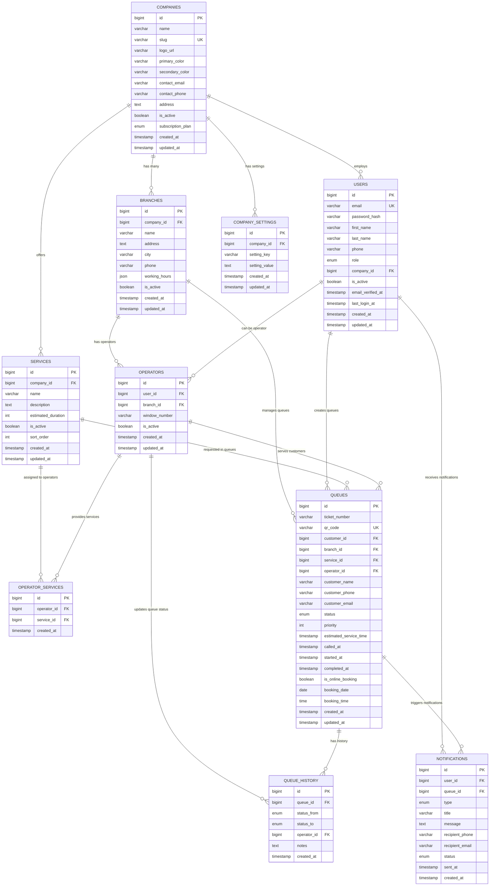

# E-Queue Entity Relationship Diagram (ERD)

## Database Tables and Relationships



## Detailed Relationship Descriptions

### 1. Companies (Parent Entity)

- **One-to-Many** with Branches: Har bir kompaniya ko'plab filiallarga ega
- **One-to-Many** with Users: Kompaniya xodimlari (admin, operator)
- **One-to-Many** with Services: Kompaniya taklif qiladigan xizmatlar
- **One-to-Many** with Company_Settings: Kompaniya sozlamalari

### 2. Branches (Filiallar)

- **Many-to-One** with Companies: Har bir filial bitta kompaniyaga tegishli
- **One-to-Many** with Operators: Filialda ishlaydigan operatorlar
- **One-to-Many** with Queues: Filialdagi navbatlar

### 3. Users (Ko'p roleli)

- **Many-to-One** with Companies: Xodimlar kompaniyaga tegishli (CUSTOMER va SUPER_ADMIN bundan mustasno)
- **One-to-Many** with Operators: User operator bo'lishi mumkin
- **One-to-Many** with Queues: Mijoz sifatida navbat yaratishi mumkin
- **One-to-Many** with Notifications: Bildirishnomalar olishi

### 4. Services (Xizmatlar)

- **Many-to-One** with Companies: Har bir xizmat kompaniyaga tegishli
- **Many-to-Many** with Operators: Operator bir nechta xizmat ko'rsatishi mumkin
- **One-to-Many** with Queues: Xizmat uchun navbatlar

### 5. Operators (Operatorlar)

- **Many-to-One** with Users: Har bir operator user hisoblanadi
- **Many-to-One** with Branches: Operator bitta filialda ishlaydi
- **Many-to-Many** with Services: Operator bir nechta xizmat ko'rsatishi mumkin
- **One-to-Many** with Queues: Operator navbatlarni xizmat qiladi

### 6. Queues (Navbatlar) - Markaziy Entity

- **Many-to-One** with Users: Mijoz (ixtiyoriy)
- **Many-to-One** with Branches: Qaysi filialda
- **Many-to-One** with Services: Qanday xizmat
- **Many-to-One** with Operators: Qaysi operator xizmat qiladi
- **One-to-Many** with Queue_History: Navbat tarixi
- **One-to-Many** with Notifications: Bildirishnomalar

## Multi-Tenancy Implementation

### Tenant Isolation Strategy

```sql
-- Har bir query da company_id orqali filtrlash
SELECT * FROM branches WHERE company_id = :current_company_id;
SELECT * FROM services WHERE company_id = :current_company_id;
SELECT * FROM queues q
JOIN branches b ON q.branch_id = b.id
WHERE b.company_id = :current_company_id;
```

### Row Level Security (RLS)

```sql
-- PostgreSQL uchun misol
CREATE POLICY company_isolation ON branches
FOR ALL TO application_user
USING (company_id = current_setting('app.current_company_id')::bigint);
```

## Indexing Strategy

### Primary Indexes

- All primary keys (id columns)
- Unique constraints (email, qr_code, slug)

### Performance Indexes

```sql
-- Multi-tenant queries uchun
CREATE INDEX idx_company_branches ON branches(company_id);
CREATE INDEX idx_company_services ON services(company_id);
CREATE INDEX idx_company_users ON users(company_id, role);

-- Queue management uchun
CREATE INDEX idx_branch_service_status ON queues(branch_id, service_id, status);
CREATE INDEX idx_operator_queues ON queues(operator_id, status);
CREATE INDEX idx_booking_date ON queues(booking_date, booking_time);

-- Real-time updates uchun
CREATE INDEX idx_queue_status ON queues(status, created_at);
CREATE INDEX idx_notifications_pending ON notifications(status, type);
```

## Data Flow Examples

### 1. Navbat Olish Jarayoni

```
Customer → Companies → Branches → Services → Queue Creation
    ↓
Queue → Operator Assignment → Notifications → Queue Updates
```

### 2. Operator Workflow

```
Operator Login → Branch Context → Available Queues → Call Customer → Update Status
```

### 3. Multi-Service Logic

```
Service Selection → Available Operators → Load Balancing → Queue Assignment
```

Bu ERD E-Queue tizimining barcha asosiy entitylari va ularning o'zaro bog'lanishlarini ko'rsatadi. Multi-tenant arxitektura, scalability va performance optimizatsiya hisobga olingan.
